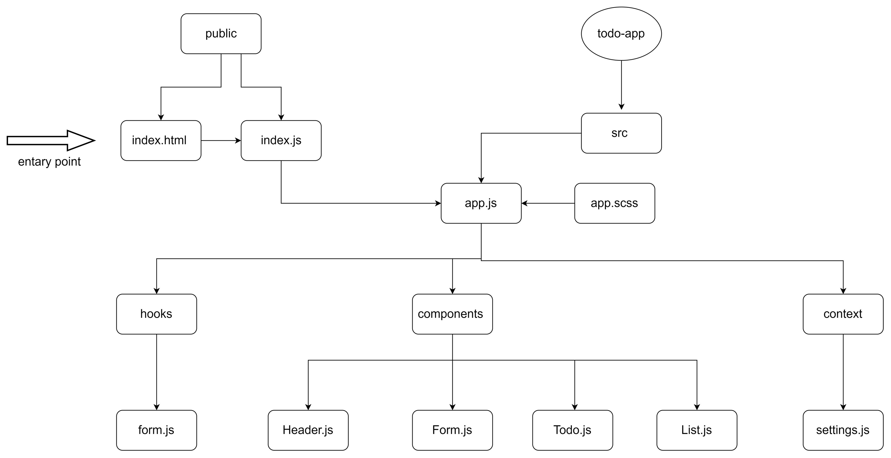
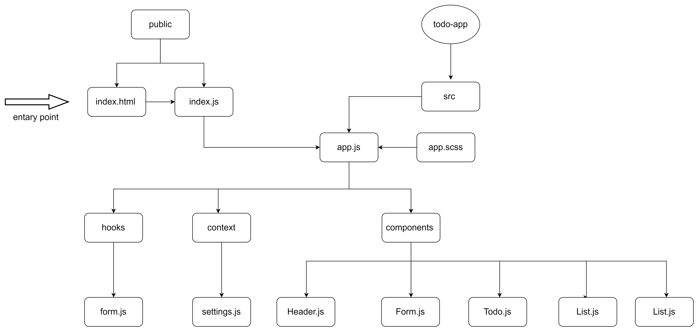

# To Do List Manager

this is a practice projecat for week 7 at asac 401 course

A Web Application for securely managing a To Do List

## lab 31

- **_Phase 1_**: Application Setup
  Basic To Do List Management, using Hooks

[pull request](https://github.com/hibasalem/todo-app-/pull/2)  
[netlify](https://adoring-cray-134ddc.netlify.app/)

---

## lab 32

- **_Phase 2_**:  Incorporate configuration settings to the application

[pull request](https://github.com/hibasalem/todo-app-/pull/3)  
[netlify](https://infallible-gates-fed185.netlify.app/)

---
