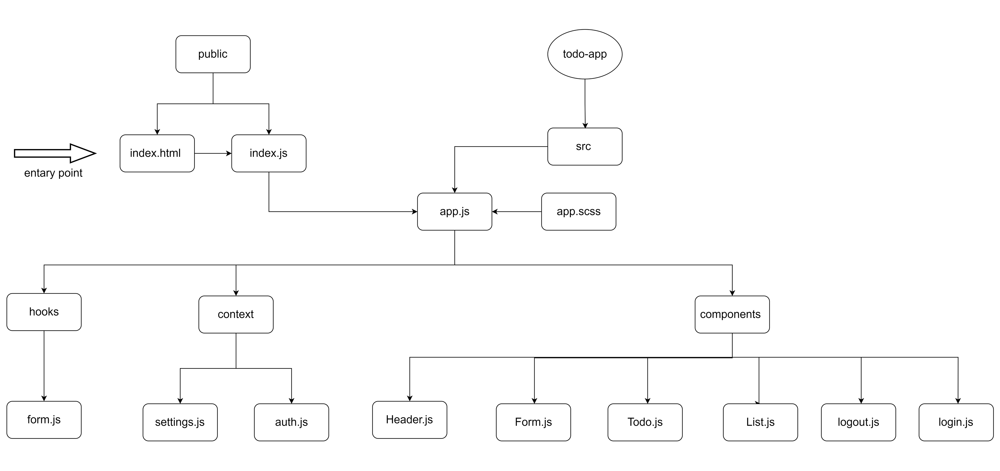

# To Do List Manager

this is a practice projecat for week 7 at asac 401 course

A Web Application for securely managing a To Do List

## lab 31

- **_Phase 1_**: Application Setup
  Basic To Do List Management, using Hooks

[pull request](https://github.com/hibasalem/todo-app-/pull/2)  
[netlify](https://adoring-cray-134ddc.netlify.app/)

---

## lab 32

- **_Phase 2_**: Incorporate configuration settings to the application

[pull request](https://github.com/hibasalem/todo-app-/pull/3)  
[netlify](https://infallible-gates-fed185.netlify.app/)

---

## lab 33

- **_Phase 3_**: Adding security and access controls to the application.

[pull request](https://github.com/hibasalem/todo-app-/pull/4)  
[netlify](https://thirsty-euler-c6155e.netlify.app/)

getting started :
* sign up and choose a role 
* log in 
* components will be rendered based on the role as the following: 
    * **user** : read  ( use this user for testing name : `aa4` password : `0000` )
    * **creater** : read create ( use this user for testing name : `aa1` password : `0000` )
    * **editor** : read create update ( use this user for testing name : `aa2` password : `0000` )
    * **admin** : read create update delete  ( use this user for testing name : `aa1` password : `0000` )

---
